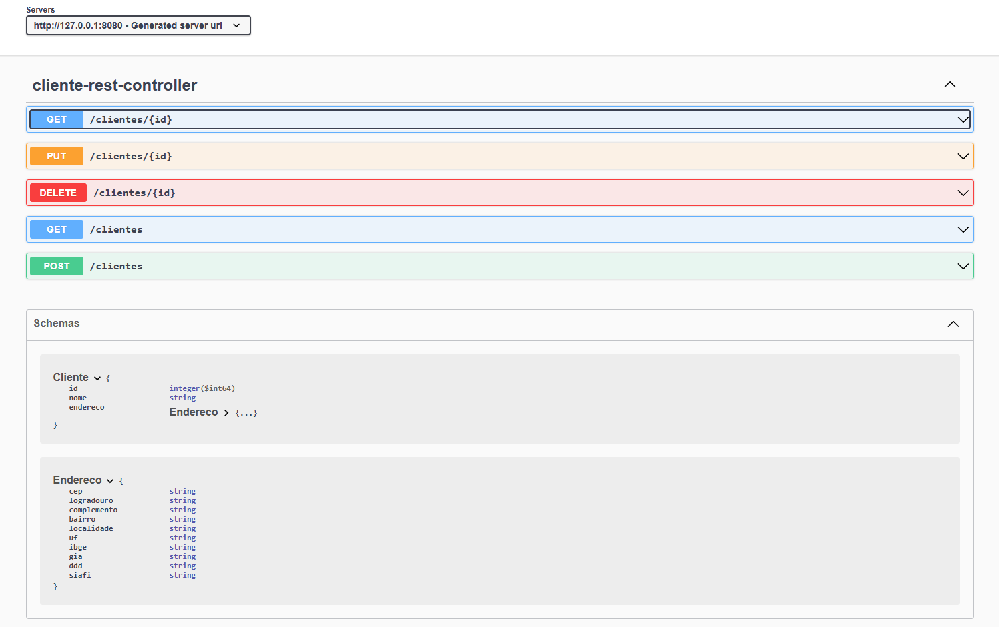

### Adicionando Interação com banco de dados e API Rest

- #### Esta API demonstra o funcionamento de uma Web API e sua interação com Swagger.

### Tecnologias:

 

### Funcionalidades utilizadas:

- Cadastro de Cliente, e ID.
- Busca por nome e ID.
- Deletar dados.
- Inserir dados.

#### Para testar a API, recomendo o aplicativo postman. Executar api e abrir swagger na porta local.

